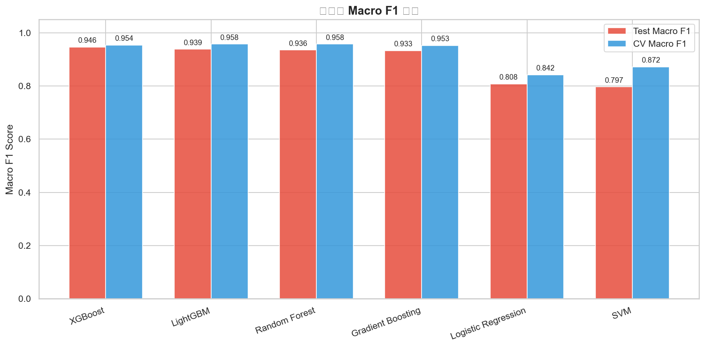
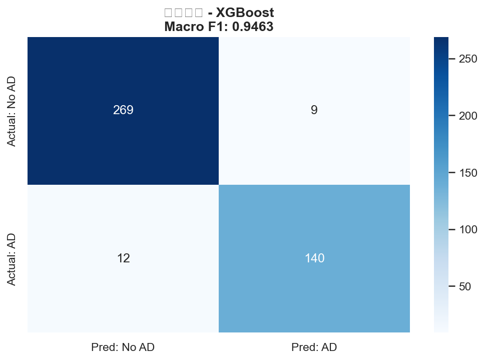
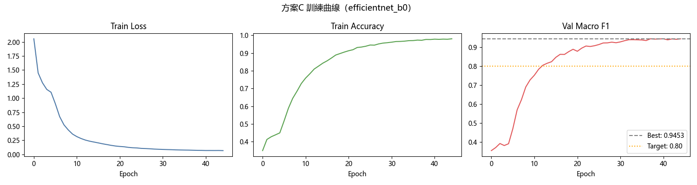
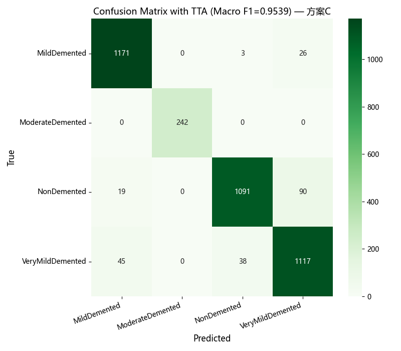

# Alzheimer’s Medical AI

這是大學「人工智慧醫療」課程的作品整理，包含兩個阿茲海默症機器學習實驗：臨床表格資料的二元分類，以及腦部 MRI 的四分類。此專案用於學習與作品展示，**不是醫療器材，也不可用於臨床診斷或醫療決策**。

## 實驗成果

| 實驗 | 方法 | 評估方式 | 最佳結果 |
| --- | --- | --- | --- |
| 臨床表格分類 | 多模型比較，最佳為 XGBoost | Macro F1 | **0.9463** |
| MRI 四分類 | EfficientNet-B0、類別平衡、Focal Loss、TTA | 驗證集 Macro F1 | **0.9539** |

MRI 實驗在未使用 TTA 時為 0.9453；五次 TTA 後為 0.9539。以上是課程實驗結果，不代表對外部醫院或不同族群的泛化能力。

## 我做了什麼

### 1. 臨床與生活型態資料

- 完成資料清理、探索性分析、相關性與特徵重要度分析。
- 比較 Logistic Regression、Random Forest、Gradient Boosting 與 XGBoost。
- 使用分層切分及 Macro F1，避免只看整體準確率而忽略類別表現。





### 2. MRI 四分類

- 將目標分為 NonDemented、VeryMildDemented、MildDemented、ModerateDemented。
- 使用 EfficientNet-B0 遷移學習，並以抽樣、類別權重、Focal Loss 與 label smoothing 處理類別不平衡。
- 分階段解凍模型，並用 test-time augmentation（TTA）整合預測。
- 採用病人層級切分的衍生資料，降低同一受試者影像同時出現在訓練與驗證資料的風險。





## 資料夾結構

```text
data/tabular/       可隨專案發布的合成臨床 CSV
notebooks/          兩個實驗的完整 Notebook
results/tabular/    表格實驗圖表
results/mri/        MRI 實驗的彙總圖表（不含原始 MRI）
docs/               資料來源、授權與公開檢查說明
```

## 執行方式

```bash
python -m venv .venv
# Windows: .venv\Scripts\activate
pip install -r requirements.txt
jupyter lab
```

表格 Notebook 可直接讀取倉庫內的 CSV。MRI Notebook 預期資料放在 `data/oasis-derived/`；請依 [資料來源說明](docs/DATA_SOURCES.md) 自行申請／下載，倉庫不會重新散布 MRI 或受試者 metadata。

## 公開與引用

發布前請閱讀 [DATA_SOURCES.md](docs/DATA_SOURCES.md) 與 [PUBLICATION_CHECKLIST.md](docs/PUBLICATION_CHECKLIST.md)。倉庫內各資料不一定採用相同授權；臨床 CSV 適用 CC BY 4.0，程式與課程內容的再授權則需另行確認。
